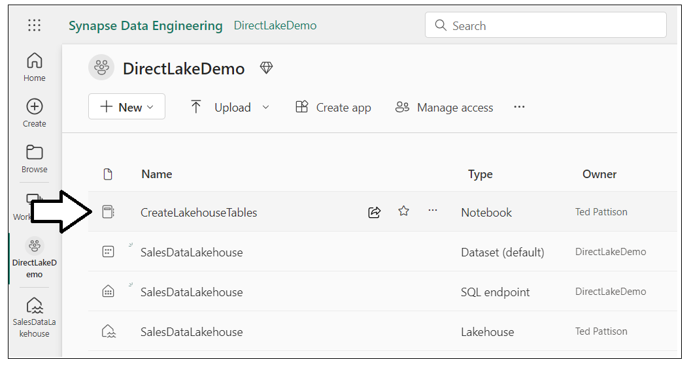
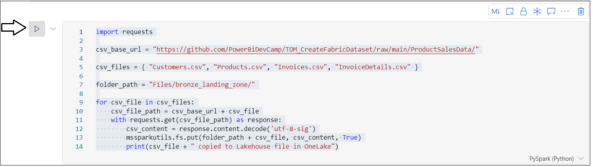
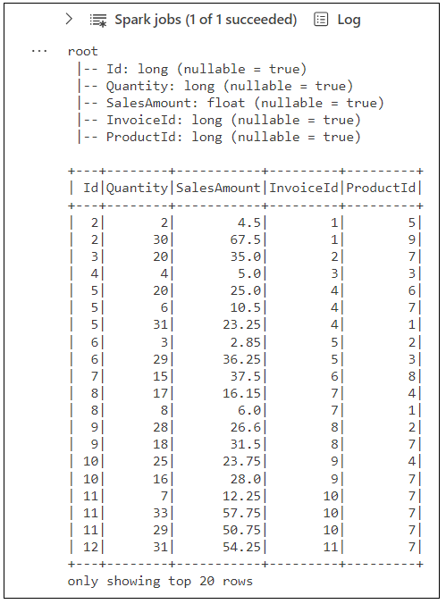
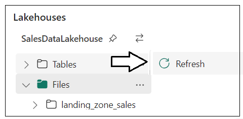
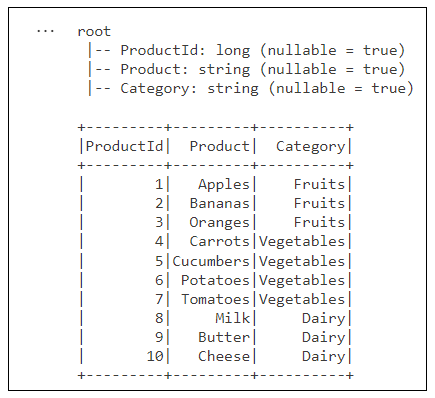
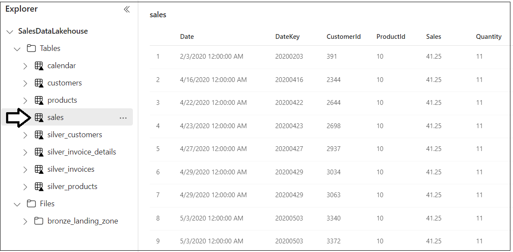
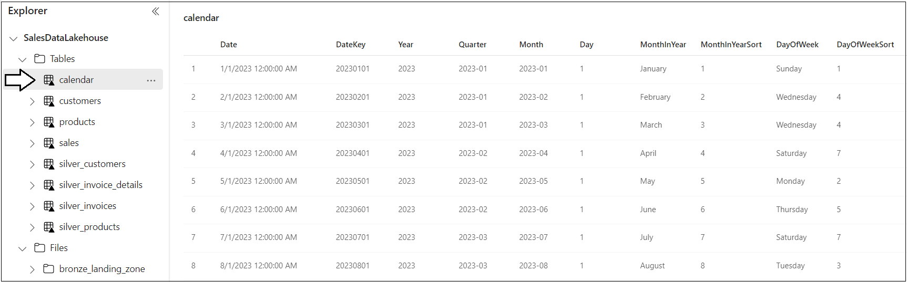
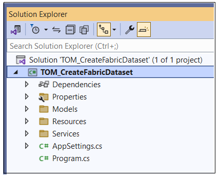
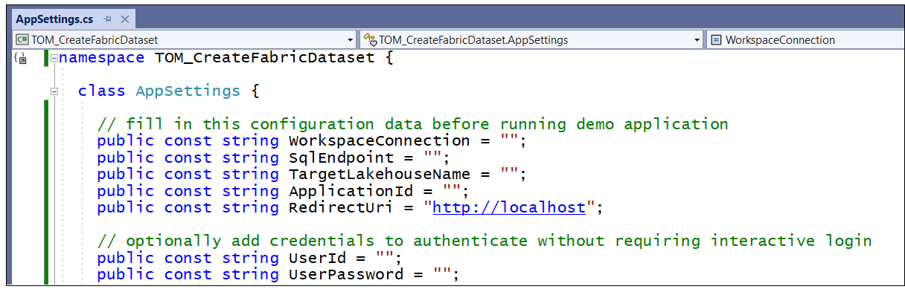
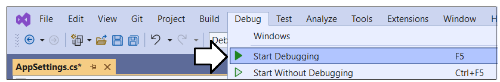

# Using TOM to Create a DirectLake Dataset

This GitHub repository contains a sample C# console application named
**TOM_CreateFabricDataset** which demonstrates how to automate the
creation of a DirectLake-mode dataset for Power BI using the Tabular
Object Model (TOM). Inside this repository, there is also a Fabric
notebook named **CreateLakehouseTables.ipynb** with Python code which
can be used to generate Lakehouse tables in delta format that will be
used as the underlying datasource for the DirectLake dataset.

Here are the high-level steps to set up and run through this demonstration:
- Create a new workspace associated with Fabric capacity
- Create a new Fabric lakehouse in the new workspace
- Generate lakehouse tables using pre-provided Python code in Fabric notebook
- Set up and run the custom C# application to automate the creation of a DirectLake datatset

## Create a new workspace associated with Fabric capacity

Create a new workspace with a name such as **DirectLakeDemo**. Make sure
the workspace is associated with a Premium capacity or a Fabric trial
capacity which provides Fabric capabilities. After creating the new
workspace named **DirectLakeDemo**, select the **Workspace settings**
menu command to display the **Workspace settings** pane.


In **Workspace settings**, select the **Premium** tab in the left
navigation and scroll down to locate the **Workspace connection**
setting. Click the **Copy** button to copy the **Workspace connection**
value to the Windows clipboard.


As you can see, the **Workspace connection** string starts with `powerbi://` and ends with the workspace name.

`powerbi://api.powerbi.com/v1.0/myorg/DirectLakeDemo`

Create a new text file using Notepad.exe to save configuration data you
will need later when configuring the C# console application. Copy the
**Workspace connection** string into the text file as shown in the
following screenshot.


## Create a new Fabric lakehouse in the new workspace

Inside the new workspace, it is time to create a new lakehouse named
**SalesDataLakehouse**. Start by dropping down the **+ New** menu button
and select **More options**.


On the **New** page select **Lakehouse (Preview)** from **Data Engineering** section.


When prompted, enter a name of **SalesDataLakehouse** for the new
Lakehouse and click **Create**.


Once you have created the lakehouse, you will notice a message
indicating a SQL Endpoint is being created.


Navigate back to the main page for the **DirectLakeDemo** workspace. In
the list of workspace items, you should see a new item for the new **SQL
endpoint** in addition to the item for the Lakehouse. Both the Lakehouse
and the SQL endpoint have the same name which is **SalesDataLakehouse**.
Drop down the context menu for the SQL endpoint named
**SalesDataLakehouse**.


Select the **Copy SQL connection string** menu command from the context
menu of the SQL endpoint.


In the **Copy SQL connection string** dialog, click **Copy** to copy the
connection string value to the Windows clipboard.


The connection string starts with a unique value and end with
**`.datawarehouse.pbidedicated.windows.net`**.

**`5lcsgl3vll3edero2m4sge7gdu-nya26urqtgsejoagwutwdoogl4.datawarehouse.pbidedicated.windows.net`**

Copy the values for the SQL endpoint and the name of the Lakehouse into
the text file with configuration values as shown in the following
screenshot.


Save the text file with these use these configuration values for later
use when setting up the C# console application.

## Create lakehouse tables using a pre-provided Fabric notebook

Start by downloading all the sources files from this GitHub repository
as a single ZIP archive named **TOM_CreateFabricDataset.zip**. You can
download the ZIP archive by clicking [**this
link**](https://github.com/PowerBiDevCamp/TOM_CreateFabricDataset/archive/refs/heads/main.zip).

Once you have downloaded the ZIP archive named
**TOM_CreateFabricDataset.zip**, extract the files from inside into a
local folder on your machine. The screenshot below shows what the folder
should look like with the extracted files. The first file you will use
is a Fabric notebook with Python code named
**CreateLakehouseTables.ipynb**.


Return to the browser and navigate to the main page of the
**DirectLakeDemo** workspace. Locate and click on the ***Fabric
Experience Switcher*** menu on the bottom right of the main workspace
page.


Select **Data Engineering** from the ***Fabric Experience Switcher***
menu.


Once you switch to the **Data Engineering** experience, locate and click
on the **Import notebook** button.


Upload Python notebook named **CreateLakehouseTables.ipynb**. After the
notebook has been imported, you should be able to see an item for it on
main workspace page. Click on **CreateLakehouseTables.ipynb** to open
this Fabric notebook in the browser.



### Associate the Fabric notebook with the lakehouse named **SalesDataLakehouse**

Once the notebook opens, you should be able to verify that it is not yet
associated with a lakehouse. Click the **Add** button in the
**Lakehouses** pane.


In the **Add lakehouse** dialog, select **Existing lakehouse** and click **Add**.


Select the lakehouse you created earlier named **SalesDataLakehouse**
and click **Add**.


Once you have associated the notebook with the lakehouse named
**SalesDataLakehouse**, you should see the **Tables** folder and the
**Files** folder in the **Lakehouses** pane which are both initially
empty.


### Copy CSV files from this repository into the file system of your Fabric Lakehouse

Now you will execute the Python code from this workbook to populate the
lakehouse with data. You will execute the Python code in each of the
notebook’s cell one by one from top to bottom. You will begin by
executing Python code to copy four CSV files from this GitHub repository
into file system of the lakehouse.

Examine the following Python code in the top notebook cell which copies CSV files to the lakehouse file system.

``` python
import requests

csv_base_url = "https://github.com/PowerBiDevCamp/Python-In-Fabric-Notebooks/raw/main/ProductSalesData/"

csv_files = { "Customers.csv", "Products.csv", "Invoices.csv", "InvoiceDetails.csv" }

folder_path = "Files/landing_zone_sales/"

for csv_file in csv_files:
    csv_file_path = csv_base_url + csv_file
    with requests.get(csv_file_path) as response:
        csv_content = response.content.decode('utf-8-sig')
        mssparkutils.fs.put(folder_path + csv_file, csv_content, True)
        print(csv_file + " copied to Lakehouse file in OneLake")
```

Execute the code in the top notebook cell by clicking the **Execute**
button located on top just to the left of the cell.



The first time you execute Python code from a Fabric notebook, it
typically takes 10-20 seconds to start up and initialize the Spark pool
which is used to process notebook code execution requests. When the
Python code completes its execution, you'll see a message for each
of the CSV files as they're copied into the lakehouse file system.


In the **Lakehouses** pane on the left, drop down the context menu for the **Files** folder.


Select the **Refresh** command from the context menu of the **Files** folder.


After the refresh operation completes, you should see a new child folder
inside the **Files** folder named **landing_zone_sales**. If you select
the **landing_zone_sales** folder in the left pane, you should be able
to see four new CSV files named **Customers.csv**,
**InvoiceDetails.csv**, **Invoices.csv** and **Products.csv** on the
right.


> At this point, you have now copied the CSV files with the raw data into
the lakehouse file system. Now you will use Spark to load this data into
memory as DataFrames where the data can be manipulated and saved as
lakehouse tables.

### Execute code in notebook to load CSV files into Spark DataFrames for the bronze layer

Examine the following Python code from the second cell in the notebook
which loads product data from **Products.csv** into a Spark DataFrame
and then displays the DataFrame schema and rows of data.

``` python
from pyspark.sql.types import StructType, StructField, StringType, LongType, FloatType

# create schema for Spark DataFrame using  StructType and StructField 
schema_products = StructType([
    StructField("ProductId", LongType() ),
    StructField("Product", StringType() ),
    StructField("Category", StringType() )
])

# use schema to load CSV data into new DataFrame
df_products = (
    spark.read.format("csv")
         .option("header","true")
         .schema(schema_products)
         .load("Files/landing_zone_sales/Products.csv")
)

df_products.printSchema()
df_products.show()
```

Execute the code in the second cell to load product data into a Spark
DataFrame. After the code completes, you should see output which
displays the DataFrame schema and 10 rows of product data.


Examine the Python code from the third cell in the notebook which loads
customer data from **Customers.csv** into a Spark DataFrame and then
displays the DataFrame schema and samples rows of data.

``` python
from pyspark.sql.types import StructType, StructField, StringType, LongType, FloatType, DateType

# creating a Spark DataFrame using schema defined with StructType and StructField 
schema_customers = StructType([
    StructField("CustomerId", LongType() ),
    StructField("FirstName", StringType() ),
    StructField("LastName", StringType() ),
    StructField("Country", StringType() ),
    StructField("City", StringType() ),
    StructField("DOB", DateType() ),
])

df_customers = (
    spark.read.format("csv")
         .option("header","true")
         .schema(schema_customers)
         .option("dateFormat", "M/d/yyyy")
         .option("inferSchema", "true")
         .load("Files/landing_zone_sales/Customers.csv")
)

df_customers.printSchema()
df_customers.show()
```
Execute the Python code in this cell to load customer data into a Spark DataFrame. After the
code completes, you should see output which displays the DataFrame schema
and displays the top 20 rows of data.


Examine the Python code in the next cell which loads customer data from
**Invoices.csv** into a Spark DataFrame and then displays the DataFrame
schema and samples rows of data.

``` python
from pyspark.sql.types import StructType, StructField, StringType, LongType, FloatType, DateType

# creating a Spark DataFrame using schema defined using StructType and StructField 
schema_invoices = StructType([
    StructField("InvoiceId", LongType() ),
    StructField("Date", DateType() ),
    StructField("TotalSalesAmount", FloatType() ),
    StructField("CustomerId", LongType() )
])

df_invoices = (
    spark.read.format("csv")
         .option("header","true")
         .schema(schema_invoices)
         .option("dateFormat", "MM/dd/yyyy")
         .option("inferSchema", "true") 
         .load("Files/landing_zone_sales/Invoices.csv")
)

df_invoices.printSchema()
df_invoices.show()
```

Execute the code to load invoice data into a Spark DataFrame. After the
code completes, you should see output which displays the DataFrame schema
and displays the top 20 rows of data.


Examine the Python code in the next cell which loads customer data from
**InvoiceDetails.csv** into a Spark DataFrame and then displays the
DataFrame schema and samples rows of data.

``` python
from pyspark.sql.types import StructType, StructField, StringType, LongType, FloatType, DateType

# creating a Spark DataFrame using schema defined using StructType and StructField 
schema_invoice_details = StructType([
    StructField("Id", LongType() ),
    StructField("Quantity", LongType() ),
    StructField("SalesAmount", FloatType() ),
    StructField("InvoiceId", LongType() ),
    StructField("ProductId", LongType() )
])

df_invoice_details = (
    spark.read.format("csv")
         .option("header","true")
         .schema(schema_invoice_details)
         .option("dateFormat", "MM/dd/yyyy")
         .option("inferSchema", "true") 
         .load("Files/landing_zone_sales/InvoiceDetails.csv")
)

df_invoice_details.printSchema()
df_invoice_details.show()
```

Execute the code to load invoice detail data into a Spark DataFrame.
After the code completes, you should see output which displays the
DataFrame schema and displays the top 20 rows of data.



> At this point you have created four DataFrames. However, you have only loaded data
into memory. Nothing has been persisted. Now it’s time to actually
persist your work by saving each of the four DataFrames to lakehouse
tables using the delta format.

### Execute code to save the four DataFrames as delta tables in the lakehouse

Execute the code in the next cell which saves all four DataFrames as lakehouse tables in the delta format.

``` python
# save all bronze layer tables
df_products.write.mode("overwrite").format("delta").save(f"Tables/bronze_products")
df_customers.write.mode("overwrite").format("delta").save(f"Tables/bronze_customers")
df_invoices.write.mode("overwrite").format("delta").save(f"Tables/bronze_invoices")
df_invoice_details.write.mode("overwrite").format("delta").save(f"Tables/bronze_invoice_details")

```
Once the code which creates the lakehouse tables completes, click the **Refresh** context menu of the **Tables** folder.



Once the refresh operation completes, you should be able to see four
tables created for the Bronze layer.


> At this point, you have created delta tables for the bronze layer which
represents the raw data without any data cleansing or manipulation. In
the next step, you will perform transformations on the data in the
bronze layer tables to create the silver layer tables.

### Reshape and Transform Data in Bronze Layer Tables to Create Silver Layer Tables

Move to the next cell in the notebook which contains the following code
to load the table named **bronze_products** and then saves the data to a
second delta table named **products**. Note this Python code is simple
in that it does not perform any transformations. However, it shows the
basic pattern of loading a table into a DataFrame and then saving itback as
a delta table with another name.

``` python
# create silver layer products table
df_silver_products = spark.read.format("delta").load("Tables/bronze_products")
df_silver_products.write.mode("overwrite").format("delta").save(f"Tables/products")
df_silver_products.printSchema()
df_silver_products.show()
```

Execute the code to create the **products** table. After the code
completes, you should see output which display the DataFrame schema and
displays the top 20 rows of data from the **products** table.



Move to the next cell which contains the following code to load the
table named **bronze_customers** and then saves it to a second delta
table named **customers**. This code written to create the **customers**
table is a bit more involved because it creates two new columns named
**Customer** and **Age** and it drops two columns named **FirstName**
and **LastName**.

``` python
# create silver layer customers table
from pyspark.sql.functions import concat_ws, floor, datediff, current_date, col

df_silver_customers = (
    spark.read.format("delta").load("Tables/bronze_customers")
            .withColumn("Customer", concat_ws(' ', col('FirstName'), col('LastName')) )
            .withColumn("Age",( floor( datediff( current_date(), col("DOB") )/365.25) ))   
            .drop('FirstName', 'LastName')
)

df_silver_customers.write.mode("overwrite").format("delta").save(f"Tables/customers")

df_silver_customers.printSchema()
df_silver_customers.show()
```

Execute the code to create the **customers** table. After the code
completes, you should see output which display the DataFrame schema and
displays the top 20 rows of data from the **customers** table.


Move to the next cell which contains the following code to create the
**sales** table. This code merges data from the **bronze_invoices**
table and the **bronze_invoice_details** table into a single DataFrame.
This code performs several other transformations including renaming a
column, generating an integer-based **DateKey** column, dropping
unneeded columns and rearranging the order of columns.

``` python
# create silver layer sales table
from pyspark.sql.functions import col, desc, concat, lit, floor, datediff
from pyspark.sql.functions import date_format, to_date, current_date, year, month, dayofmonth

df_bronze_invoices = spark.read.format("delta").load("Tables/bronze_invoices")
df_bronze_invoice_details = spark.read.format("delta").load("Tables/bronze_invoice_details")

df_silver_sales = (
    df_bronze_invoice_details
            .join(df_bronze_invoices, 
                  df_bronze_invoice_details['InvoiceId'] == df_bronze_invoices['InvoiceId'])
            .withColumnRenamed('SalesAmount', 'Sales')
            .withColumn("DateKey", (year(col('Date'))*10000) + 
                                   (month(col('Date'))*100) + 
                                   (dayofmonth(col('Date')))   )
            .drop('InvoiceId', 'TotalSalesAmount', 'InvoiceId', 'Id')
            .select('Date', "DateKey", "CustomerId", "ProductId", "Sales", "Quantity")
)

df_silver_sales.write.mode("overwrite").format("delta").save(f"Tables/sales")

df_silver_sales.printSchema()
df_silver_sales.show()
```

Execute the code to create the **sales** table. After the code
completes, you should see output which display the DataFrame schema and
displays the top 20 rows of data from the **sales** table.


Move down to the last cell in the notebook which generates the
**calendar** table used for time-based analysis. If you examine the
code, you can see it uses the first and last dates from the **Date**
column of the **sales** table to determine where to start and to end the
**calendar** table.

``` python
# create silver layer calendar table 
import pandas as pd
from datetime import datetime, timedelta, date
import os

from pyspark.sql.functions import to_date, year, month, dayofmonth, quarter, dayofweek

first_sales_date = df_silver_sales.agg({"Date": "min"}).collect()[0][0]
last_sales_date = df_silver_sales.agg({"Date": "max"}).collect()[0][0]

start_date = date(first_sales_date.year, 1, 1)
end_date = date(last_sales_date.year, 12, 31)

os.environ["PYARROW_IGNORE_TIMEZONE"] = "1"
df_calendar_ps = pd.date_range(start_date, end_date, freq='D').to_frame()

df_calendar_spark = (
     spark.createDataFrame(df_calendar_ps)
       .withColumnRenamed("0", "timestamp")
       .withColumn("Date", to_date(col('timestamp')))
       .withColumn("DateKey", (year(col('timestamp'))*10000) + 
                              (month(col('timestamp'))*100) + 
                              (dayofmonth(col('timestamp')))   )
       .withColumn("Year", year(col('timestamp'))  )
       .withColumn("Quarter", date_format(col('timestamp'),"yyyy-QQ")  )
       .withColumn("Month", date_format(col('timestamp'),'yyyy-MM')  )
       .withColumn("Day", dayofmonth(col('timestamp'))  )
       .withColumn("MonthInYear", date_format(col('timestamp'),'MMMM')  )
       .withColumn("MonthInYearSort", month(col('timestamp'))  )
       .withColumn("DayOfWeek", date_format(col('timestamp'),'EEEE')  )
       .withColumn("DayOfWeekSort", dayofweek(col('timestamp')))
       .drop('timestamp')
)

df_calendar_spark.write.mode("overwrite").format("delta").save(f"Tables/calendar")
df_calendar_spark.printSchema()
df_calendar_spark.show()
```

Execute the code to create the **calendar** table. After the code
completes, you should see output which display the DataFrame schema and
displays the top 20 rows of data from the **calendar** table.


Now refresh the **Tables** folder in the **Lakehouses** pane. You should
now see the four delta tables named **calendar**, **customers**, **products** and
**sales. There are the delta tables that will be used to create the
DirectLake-mode dataset.


### Inspect the tables that have been created in the lakehouse

Navigate to the main page of the **DirectLakeDemo** workspace and then
click on the workspace item for the lakehouse named
**SalesDataLakehouse**.


Now you can see and inspect the tables in the lakehouse. Start by
clicking on the **products** table to see its contents.


Inspect the data in the **customers** table.


Inspect the data in the **sales** table.



Inspect the data in the **sales** table.



Now all Lakehouse tables have been created and you can move on to the
next step where you create the DirectLake dataset using the custom
application with C# code.

> In case you have not heard, Microsoft recently renamed ***Azure Active
Directory*** to ***Microsoft Entra ID***. In the past, you would uses
the Azure AD portal to create an Azure application which can be used to
call Microsoft APIs such as the Tabular Object Model. Now, you will use
the **Microsoft Entra admin center** to create a new application for the
C# console application.

## Run the C# application to create DirectLake dataset using TOM

In order to set up the C# console application, you must first create a
new application. Start by navigating to **Microsoft Entra admin center**
at the following URL.

<https://entra.microsoft.com/>

On the home page of the **Microsoft Entra admin center**, drop down the
**Applications** section in the left navigation and click the **App
registrations** link.


On the **App registrations** page, click **New registration**.


Give the new application a name such as **Create DirectLake Dataset Demo
App** and leave the Supported account types setting with the default
selection of **Accounts in this organizational directory only**.


Move down to the **Redirect URI** section. Select **Public
client/native** application in the drop down menu and enter a redirect
URI of <http://localhost>. Make sure to create the URL with **http** and
not **https**.


Click **Register** to create the new application.


Now that you have created the application, you need to record
Application ID for use in C# console application. Copy the **Application
ID** from the application summary page in the Microsoft Entra admin
center.


Add the Application ID and Redirect URI of <http://localhost> into the
text file with configuration data.


Now you have all the configuration data you need to set up and run the
C# console application to create the DirectLake-mode dataset.

### Open C# console application project in Visual Studio 2022

In an earlier step you extracted all the files from this repository into
a local folder. If you examine the files in this folder, you will see a
Visual Studio solution file named **TOM_CreateFabricDataset.sln**.


Double-click on **TOM_CreateFabricDataset.sln** to open the project in
Visual Studio 2022. You should see the project structure as shown in the
following screenshot.



Open the C# file named **AppSettings.cs** so you can update
configuration values used by the application.


You can see **AppSettings.cs** has several constant for configuration
values that need to be filled in before running the application.



Update **AppSettings.cs** by adding configuration values for
**WorkspaceConnection**, **SQLEndpoint**, **TargetLakehouseName**,
**ApplicationID**. You should also endure that **RedirectUrl** is
correctly set to **http://localhost**.


You can optionally update **AppSettings.cs** with your **UserId** and
UserPassword if you want to avoid an interactive login each time you run
the application. If you leave these values blank, you will be promoted
to login each time you run the application.

Save your changes to **AppSettings.cs**. You are now ready to run the
application.

### Run the application to create the DirectLake-mode Dataset

Either press **{F5}** or select **Debug \> Start Debugging** to run the
application.



When the application starts, you will be promoted to login. Log in using
the same user account you have been using throughout this demo.


After successfully logging in, wait until the program completes. It
might take as long as 20-30 seconds.

>

The application should run and complete without any errors. When the
application completes, navigate to the home page of the
**DirectLakeDemo** workspace and verify that you can see new dataset
named **DirectLake Sales Model**. Click on the named **DirectLake Sales
Model** item to navigate to its details page.


On the **Details for DirectLake Sales Model** page, click **+ Create a
report** to drop down this menu.


Select **Start from scratch** to create a new report so you can test out
the new dataset.


You should now be able to build a report using this DirectLake-mode
dataset.


Examine the **Sales** table which contains three measures.


Examine the **Customer** table which contains several columns and a
dimensional hierarchy.


Examine the **Products** table which contains several columns and a
dimensional hierarchy.


Examine the **Calendar** table which contains several columns and a
dimensional hierarchy.


You have now generated a DirectLake-mode dataset which can be used to
create Power BI reports. Designing a report that looks good is left as
an exercise for the reader.