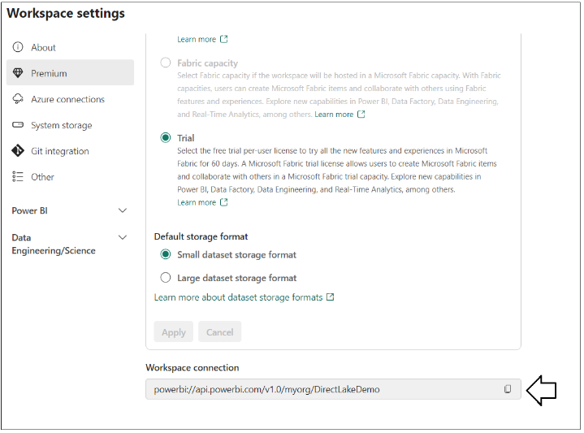
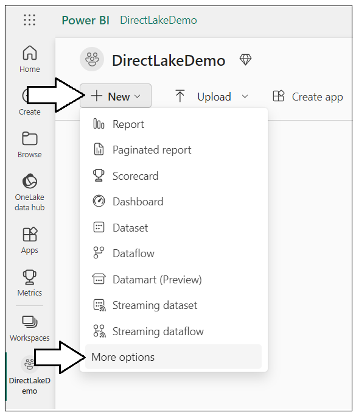
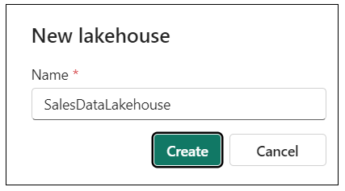
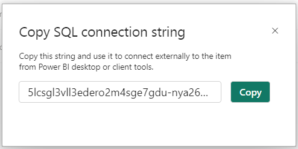
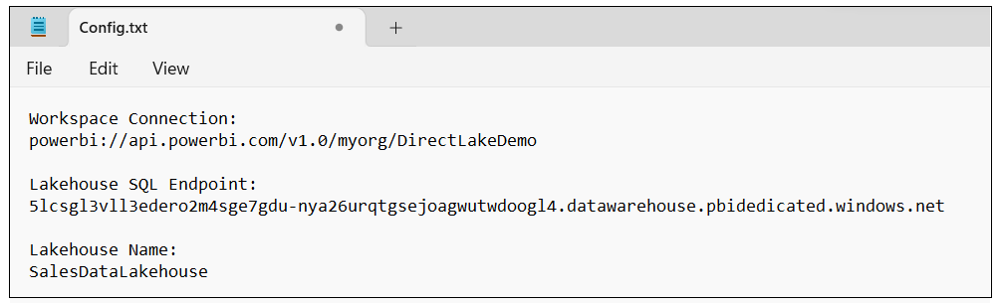
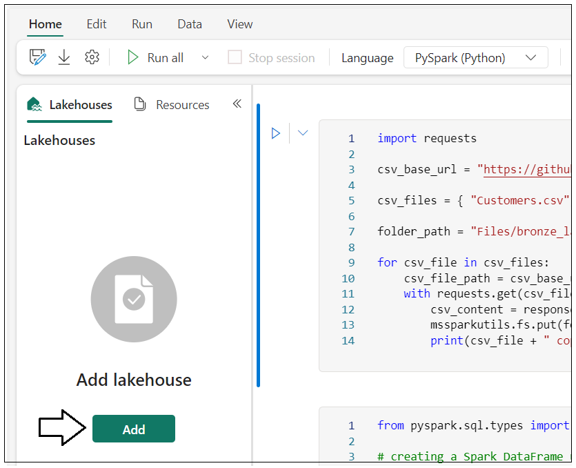
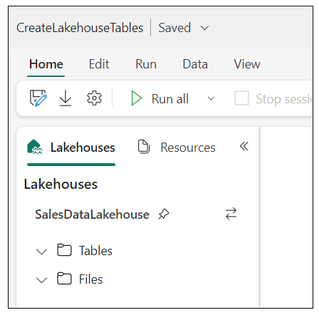
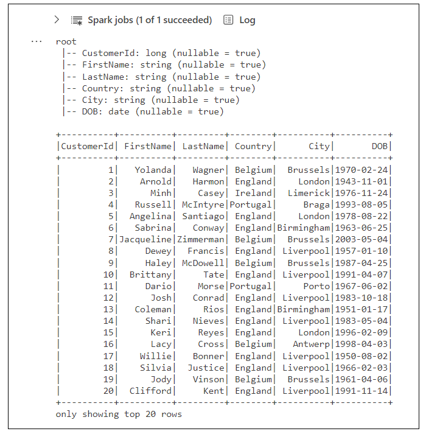
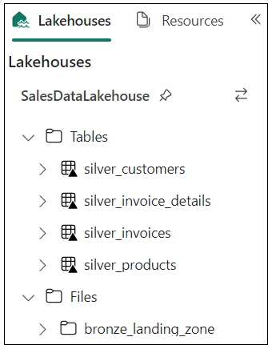

# Using TOM to Create a DirectLake Dataset

This repository contains C# console application named
**TOM_CreateFabricDataset** which demonstrates how to create a
DirectLake data model for Fabric and Power BI using the Tabular Object
Model (TOM). This repository also contains a Fabric notebook named
**CreateLakehouseTables.ipynb** with Python code which must be used to
create tables in a Fabric Lakehouse that will be used as the underlying
datasource for the DirectLake data model.

Here are the high-level steps to completing this demonstration:

- Create workspace associated with Fabric capacity

- Create a new Lakehouse in the new workspace

- Create Lakehouse tables using a pre-provided Fabric notebook

- Run the custom C# application to create DirectLake data model using
  TOM

## Create workspace associated with Fabric capacity

Create a new workspace with a name such as **DirectLakeDemo**. Make sure
the workspace is associated with a Premium capacity or a trial capacity
with Fabric capabilities.

Get URL to Workspace Connection


The new

powerbi://api.powerbi.com/v1.0/myorg/DirectLakeDemo

## Create a new Lakehouse in the new workspace

Inside the new workspace, create a new Lakehouse named
**SalesDataLakehouse**.



Ssss


Sss



Ssss


Sssssss



Get Lakehouse SQL Endpoint


Ssss

5lcsgl3vll3edero2m4sge7gdu-nya26urqtgsejoagwutwdoogl4**.datawarehouse.pbidedicated.windows.net**

## Create Lakehouse tables using a pre-provided Fabric notebook

Download all the sources files from this repository as a single ZIP
archive using [**this
link**](https://github.com/PowerBiDevCamp/TOM_CreateFabricDataset/archive/refs/heads/main.zip).
When you look inside the ZIP archive, you should see several files
inside. Extract the files into a local folder on your machine.


Back to Fabric UI.


Sssss



Aaaaa



Upload Python notebook named **CreateLakehouseTables.ipynb**.


### Associate the Fabric Notebook with the Lakehouse named SalesDataLakehouse

ddddd


Associate notebook named **CreateLakehouseTables.ipynb** with Lakehouse


Sss


Ssss


### Copy CSV files from this repository into the file system of your Fabric Lakehouse

Execute code in notebook to copy CSV files from GitHib repository into
Lakehouse file system
``` python
import requests

csv_base_url = "https://github.com/PowerBiDevCamp/Python-In-Fabric-Notebooks/raw/main/ProductSalesData/"

csv_files = { "Customers.csv", "Products.csv", "Invoices.csv", "InvoiceDetails.csv" }

folder_path = "Files/landing_zone_sales/"

for csv_file in csv_files:
    csv_file_path = csv_base_url + csv_file
    with requests.get(csv_file_path) as response:
        csv_content = response.content.decode('utf-8-sig')
        mssparkutils.fs.put(folder_path + csv_file, csv_content, True)
        print(csv_file + " copied to Lakehouse file in OneLake")
```

xx



Sssss


Sssss


Sss



Sss


xxx

### Execute code in notebook to load CSV files into Spark DataFrames for the bronze layer

Examine the code

from pyspark.sql.types import StructType, StructField, StringType,
LongType, FloatType

\# creating a Spark DataFrame using schema defined using StructType and
StructField

schema_products = StructType(\[

StructField("ProductId", LongType() ),

StructField("Product", StringType() ),

StructField("Category", StringType() )

\])

df_products = (

spark.read.format("csv")

.option("header","true")

.schema(schema_products)

.load("Files/landing_zone_sales/Products.csv")

)

df_products.printSchema()

df_products.show()

ssssss


Xx

from pyspark.sql.types import StructType, StructField, StringType,
LongType, FloatType, DateType

\# creating a Spark DataFrame using schema defined with StructType and
StructField

schema_customers = StructType(\[

StructField("CustomerId", LongType() ),

StructField("FirstName", StringType() ),

StructField("LastName", StringType() ),

StructField("Country", StringType() ),

StructField("City", StringType() ),

StructField("DOB", DateType() ),

\])

df_customers = (

spark.read.format("csv")

.option("header","true")

.schema(schema_customers)

.option("dateFormat", "M/d/yyyy")

.option("inferSchema", "true")

.load("Files/landing_zone_sales/Customers.csv")

)

df_customers.printSchema()

df_customers.show()

xxx


Xxx

from pyspark.sql.types import StructType, StructField, StringType,
LongType, FloatType, DateType

\# creating a Spark DataFrame using schema defined using StructType and
StructField

schema_invoices = StructType(\[

StructField("InvoiceId", LongType() ),

StructField("Date", DateType() ),

StructField("TotalSalesAmount", FloatType() ),

StructField("CustomerId", LongType() )

\])

df_invoices = (

spark.read.format("csv")

.option("header","true")

.schema(schema_invoices)

.option("dateFormat", "MM/dd/yyyy")

.option("inferSchema", "true")

.load("Files/landing_zone_sales/Invoices.csv")

)

df_invoices.printSchema()

df_invoices.show()

xx


Xx

from pyspark.sql.types import StructType, StructField, StringType,
LongType, FloatType, DateType

\# creating a Spark DataFrame using schema defined using StructType and
StructField

schema_invoice_details = StructType(\[

StructField("Id", LongType() ),

StructField("Quantity", LongType() ),

StructField("SalesAmount", FloatType() ),

StructField("InvoiceId", LongType() ),

StructField("ProductId", LongType() )

\])

df_invoice_details = (

spark.read.format("csv")

.option("header","true")

.schema(schema_invoice_details)

.option("dateFormat", "MM/dd/yyyy")

.option("inferSchema", "true")

.load("Files/landing_zone_sales/InvoiceDetails.csv")

)

df_invoice_details.printSchema()

df_invoice_details.show()

xxx


### Execute code to Save the Four DataFrames as Delta Tables in the Lakehouse

Xxxx

\# save all bronze layer tables

df_products.write.mode("overwrite").format("delta").save(f"Tables/bronze_products")

df_customers.write.mode("overwrite").format("delta").save(f"Tables/bronze_customers")

df_invoices.write.mode("overwrite").
format("delta").save(f"Tables/bronze_invoices")

df_invoice_details.write.mode("overwrite")format("delta").save(f"Tables/bronze_invoice_details")

xxxx


Sssss



### Reshape and Transform Data in Bronze Layer Tables to Create Silver Layer Tables

Ssss

\# create silver layer products table

df_silver_products =
spark.read.format("delta").load("Tables/bronze_products")

df_silver_products.write.mode("overwrite").format("delta").save(f"Tables/products")

df_silver_products.printSchema()

df_silver_products.show()

cccc


Xx

\# create silver layer customers table

from pyspark.sql.functions import concat_ws, floor, datediff,
current_date, col

df_silver_customers = (

spark.read.format("delta").load("Tables/bronze_customers")

.withColumn("Customer", concat_ws(' ', col('FirstName'),
col('LastName')) )

.withColumn("Age",( floor( datediff( current_date(), col("DOB")
)/365.25) ))

.drop('FirstName', 'LastName')

)

df_silver_customers.write.mode("overwrite").format("delta").save(f"Tables/customers")

df_silver_customers.printSchema()

df_silver_customers.show()

ssss


Xx

\# create silver layer sales table

from pyspark.sql.functions import col, desc, concat, lit, floor,
datediff

from pyspark.sql.functions import date_format, to_date, current_date,
year, month, dayofmonth

df_bronze_invoices =
spark.read.format("delta").load("Tables/bronze_invoices")

df_bronze_invoice_details =
spark.read.format("delta").load("Tables/bronze_invoice_details")

df_silver_sales = (

df_bronze_invoice_details

.join(df_bronze_invoices, df_bronze_invoice_details\['InvoiceId'\] ==
df_bronze_invoices\['InvoiceId'\])

.withColumnRenamed('SalesAmount', 'Sales')

.withColumn("DateKey", (year(col('Date'))\*10000) +

(month(col('Date'))\*100) +

(dayofmonth(col('Date'))) )

.drop('InvoiceId', 'TotalSalesAmount', 'InvoiceId', 'Id')

.select('Date', "DateKey", "CustomerId", "ProductId", "Sales",
"Quantity")

)

df_silver_sales.write.mode("overwrite").format("delta").save(f"Tables/sales")

df_silver_sales.printSchema()

df_silver_sales.show()

xxxx


Xx

\# create silver layer calendar table

import pandas as pd

from datetime import datetime, timedelta, date

import os

from pyspark.sql.functions import to_date, year, month, dayofmonth,
quarter, dayofweek

first_sales_date = df_silver_sales.agg({"Date":
"min"}).collect()\[0\]\[0\]

last_sales_date = df_silver_sales.agg({"Date":
"max"}).collect()\[0\]\[0\]

start_date = date(first_sales_date.year, 1, 1)

end_date = date(last_sales_date.year, 12, 31)

os.environ\["PYARROW_IGNORE_TIMEZONE"\] = "1"

df_calendar_ps = pd.date_range(start_date, end_date,
freq='D').to_frame()

df_calendar_spark = (

spark.createDataFrame(df_calendar_ps)

.withColumnRenamed("0", "timestamp")

.withColumn("Date", to_date(col('timestamp')))

.withColumn("DateKey", (year(col('timestamp'))\*10000) +

(month(col('timestamp'))\*100) +

(dayofmonth(col('timestamp'))) )

.withColumn("Year", year(col('timestamp')) )

.withColumn("Quarter", date_format(col('timestamp'),"yyyy-QQ") )

.withColumn("Month", date_format(col('timestamp'),'yyyy-MM') )

.withColumn("Day", dayofmonth(col('timestamp')) )

.withColumn("MonthInYear", date_format(col('timestamp'),'MMMM') )

.withColumn("MonthInYearSort", month(col('timestamp')) )

.withColumn("DayOfWeek", date_format(col('timestamp'),'EEEE') )

.withColumn("DayOfWeekSort", dayofweek(col('timestamp')))

.drop('timestamp')

)

df_calendar_spark.write.mode("overwrite").format("delta").save(f"Tables/calendar")

df_calendar_spark.printSchema()

df_calendar_spark.show()

xx



Xx


### Inspect the tables that have been created in the Lakehouse

Xxxx


Xxxx


Xxx


Dddd


Xxxx


Now all Lakehouse tables have been created and you can move on top the
step where you create the DirectLake dataset using the customer
application.

## Run the custom C# application to create DirectLake data model using TOM

- Create Azure AD application

  1.  Create a native/public application with redirect URI of
      <http://localhost>

  2.  Record Application ID for use in console application.

- Download C# console application source code and open project in Visual
  Studio 2022

- Open **AppSettings.cs** and updae the following:

  1.  ApplicationID of Azure AD application

  2.  Workspace Connection

- SQL Endpoint

  1.  Lakehouse Name

  2.  UserID and Password to prevent interactive login

  3.  Save changes

- Run application

  1.  It should run without error

  2.  When done, verify you can see new data model and use it to create
      new report
